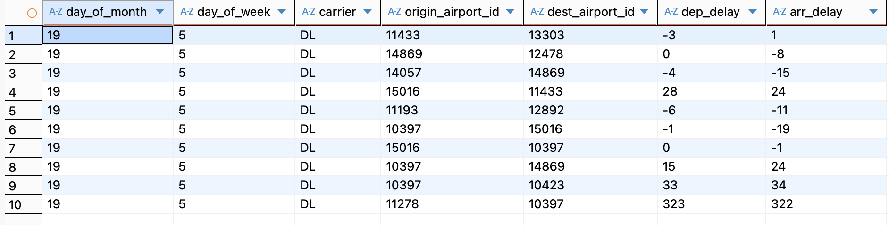
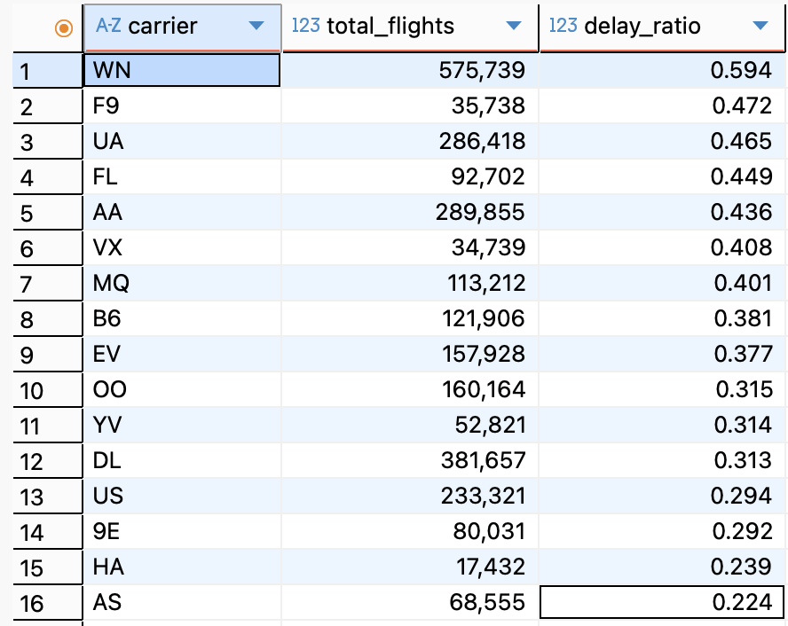
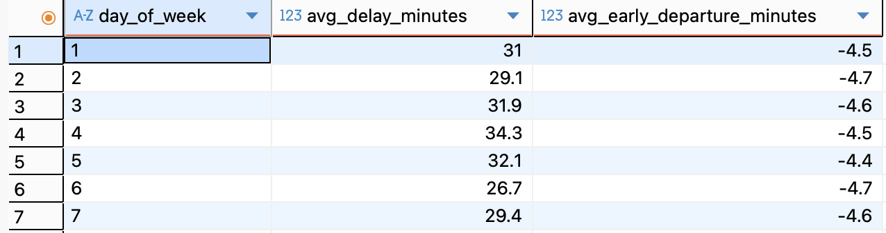
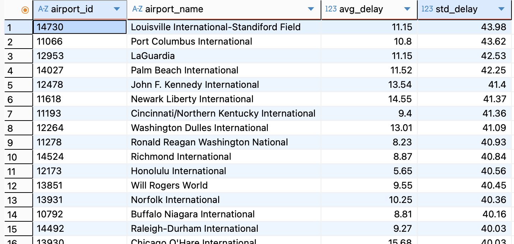
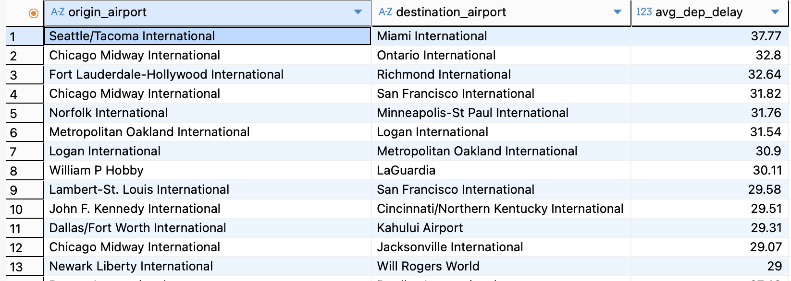
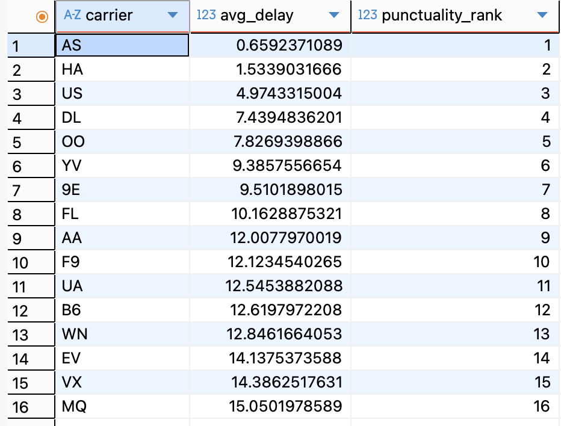

# HW2

1) запуск докера `docker compose up -d`

2) Создаем директорию для БД:
    - `docker exec -it hive-server mkdir -p /data/warehouse/analytics`

3) Подключение к Hive по SQL: (для формирования скринов в отчете было использовано подключение через DBeaver)
    - `docker exec -it hive-server beeline`
    - `!connect jdbc:hive2://localhost:10000`

4) Создание базы данных:
```
CREATE DATABASE analytics
LOCATION '/data/warehouse/analytics';
```

5) Заполняем таблицы:

- из `airports.csv`
```
USE analytics;

CREATE EXTERNAL TABLE airports (
  airport_id INT,
  city STRING,
  state STRING,
  name STRING
)
ROW FORMAT SERDE 'org.apache.hadoop.hive.serde2.OpenCSVSerde'
WITH SERDEPROPERTIES (
  "separatorChar" = ",",
  "quoteChar" = "\"",
  "skip.header.line.count" = "1"
)
STORED AS TEXTFILE
LOCATION '/data/airports';
```

```
SELECT *
FROM airports
LIMIT 10;
```


- из `flights.csv`
```
CREATE EXTERNAL TABLE flights (
  day_of_month INT,
  day_of_week INT,
  carrier STRING,
  origin_airport_id INT,
  dest_airport_id INT,
  dep_delay INT,
  arr_delay INT
)
ROW FORMAT SERDE 'org.apache.hadoop.hive.serde2.OpenCSVSerde'
WITH SERDEPROPERTIES (
  "separatorChar" = ",",
  "quoteChar" = "\"",
  "skip.header.line.count" = "1"
)
STORED AS TEXTFILE
LOCATION '/data/flights';
```

```
SELECT *
FROM flights
LIMIT 10;
```


# Витрины
1) Доля рейсов с задержкой по авиакомпаниям `carrier_delay_ratio`
```
CREATE VIEW carrier_delay_ratio AS 
SELECT
  carrier,
  COUNT(*) AS total_flights,
  ROUND(SUM(CASE WHEN dep_delay > 0 THEN 1.0 ELSE 0.0 END) / COUNT(*),3) AS delay_ratio
FROM flights
WHERE dep_delay IS NOT NULL
GROUP BY carrier;
```
```
SELECT *
FROM carrier_delay_ratio
ORDER BY delay_ratio DESC, early_dep_ratio DESC;
```



**Описание:**
- Витрина показывает, какая доля рейсов каждой авиакомпании выполняется с задержкой вылета;
- Задержкой считается рейс, у которого значение dep_delay больше нуля;
- Используется относительная метрика, что позволяет корректно сравнивать авиакомпании разного масштаба;
- Витрина позволяет выявить наименее и наиболее пунктуальные авиакомпании;
- Полученные значения отражают вероятность задержки рейса для конкретной компании;

2) Средняя задержка вылета по дням недели `avg_delay_by_weekday`
```
CREATE VIEW avg_delay_by_weekday AS
SELECT
  day_of_week,
  ROUND(AVG(CASE WHEN dep_delay > 0 THEN dep_delay END),1) AS avg_delay_minutes,
  ROUND(AVG(CASE WHEN dep_delay < 0 THEN dep_delay END),1) AS avg_early_departure_minutes
FROM flights
WHERE dep_delay IS NOT NULL
GROUP BY day_of_week;
```

```
SELECT *
FROM avg_delay_by_weekday
ORDER BY day_of_week;
```



**Описание:**
- Витрина показывает зависимость задержка вылета и раннего вылета от дня недели;
- Для расчёта средней задержки учитываются только рейсы с положительным значением dep_delay;
- Для расчёта раннего вылета учитываются только рейсы с отрицательным значением dep_delay;
- Рейсы, вылетевшие точно по расписанию, не участвуют в расчётах;
- Разделение задержек и ранних вылетов позволяет избежать взаимного сглаживания метрик;

3) Стабильность аэропортов (variance задержек) `airport_delay_stability`

```
CREATE VIEW airport_delay_stability AS
SELECT
  a.airport_id,
  a.name AS airport_name,
  ROUND(AVG(f.dep_delay),2) AS avg_delay,
  ROUND(STDDEV(f.dep_delay),2) AS std_delay
FROM flights f
JOIN airports a
  ON f.origin_airport_id = a.airport_id
WHERE f.dep_delay IS NOT NULL
GROUP BY a.airport_id, a.name
HAVING COUNT(*) > 50;
```

```
SELECT *
FROM airport_delay_stability
ORDER BY std_delay DESC;
```



**Описание:**
- Витрина показывает среднюю задержку вылета и степень вариативности задержек для каждого аэропорта;
- Средняя задержка отражает типичное отклонение времени вылета от расписания;
- Стандартное отклонение характеризует стабильность работы аэропорта: чем выше значение, тем менее предсказуемы задержки;
- Витрина позволяет выявить аэропорты с высоким уровнем нестабильности, даже при умеренной средней задержке;

4) Эффективность маршрутов (задержка на рейс) `route_efficiency`

```
CREATE VIEW route_efficiency AS
SELECT
  a1.name AS origin_airport,
  a2.name AS destination_airport,
  ROUND(AVG(f.dep_delay),2) AS avg_dep_delay
FROM flights f
JOIN airports a1 ON f.origin_airport_id = a1.airport_id
JOIN airports a2 ON f.dest_airport_id = a2.airport_id
WHERE f.dep_delay IS NOT NULL
GROUP BY a1.name, a2.name
HAVING COUNT(*) > 30;
```

```
SELECT *
FROM route_efficiency
ORDER BY avg_dep_delay DESC;
```

**Описание:**

- Витрина показывает среднюю задержку вылета для каждого маршрута `аэропорт отправления -> аэропорт назначения`;
- Метрика avg_dep_delay отражает типичную задержку рейсов на конкретном направлении;
- Для исключения нестандартных направлений используются только маршруты с количеством рейсов более 30;
- Витрина позволяет выявить маршруты с систематически  задержками;



5) Относительная нагрузка аэропортов `airport_traffic_share`

```
CREATE VIEW airport_traffic_share AS
SELECT
  airport_id,
  total_flights,
  ROUND(total_flights * 100.0 / SUM(total_flights) OVER (),2) AS traffic_share_prcnt
FROM (
  SELECT origin_airport_id AS airport_id, COUNT(*) AS total_flights
  FROM flights
  GROUP BY origin_airport_id

  UNION ALL

  SELECT dest_airport_id AS airport_id, COUNT(*) AS total_flights
  FROM flights
  GROUP BY dest_airport_id
) t;
```

```
SELECT *
FROM airport_traffic_share
ORDER BY traffic_share_prcnt DESC;
```


**Описание:**
- Витрина показывает относительную долю трафика каждого аэропорта в общем количестве рейсов;
- В расчёт включаются как рейсы на вылет, так и рейсы на прилёт;
- Метрика traffic_share_prcnt выражена в процентах;
- Витрина позволяет выявить наиболее крупные транспортные узлы и аэропорты с наибольшей нагрузкой;

6) Рейтинг авиакомпаний по пунктуальности `carrier_punctuality_rank`

```
CREATE VIEW carrier_punctuality_rank AS
SELECT
  carrier,
  avg_delay,
  RANK() OVER (ORDER BY avg_delay ASC) AS punctuality_rank
FROM (
  SELECT
    carrier,
    AVG(dep_delay) AS avg_delay
  FROM flights
  WHERE dep_delay IS NOT NULL
  GROUP BY carrier
) t;
```

```
SELECT *
FROM carrier_punctuality_rank;
```



**Описание:**
- Витрина формирует рейтинг авиакомпаний на основе средней задержки вылета;
- Средняя задержка рассчитывается как среднее значение по всем рейсам авиакомпании;
- Авиакомпании сортируются по возрастанию средней задержки: чем меньше значение, тем выше пунктуальность;