# HW3

## Подготовка

1) Установка DBeaver
2) Запуск контейнера postgres:16 через `docker compose up --build -d` с параметрами:
```
   - ports:
      - "5432:5432"
   -environment:
      POSTGRES_USER: postgres
      POSTGRES_PASSWORD: postgres123
      POSTGRES_DB: dvd_rental
```
3) Восстановление базы из бэкапа `./backups/dvd-rental.backup`
   - `docker exec -i HW3_postgress pg_restore -U postgres -d dvd_rental --clean --if-exists /backups/dvd-rental.backup`
4) Подключение DBeaver по указанным параметрам в п.2 по `localhost`
5) ER-диаграмма базы данных dvd_rental:

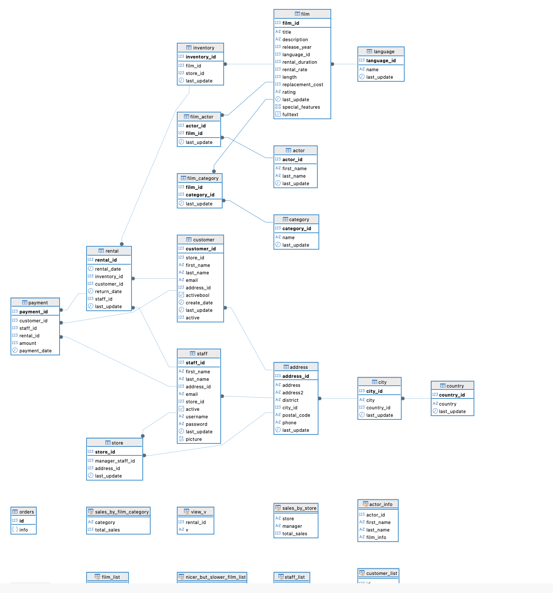

## SQL и получение данных

### 1) Вывести список всех клиентов (таблица customer).

```
SELECT * FROM public.customer;
```
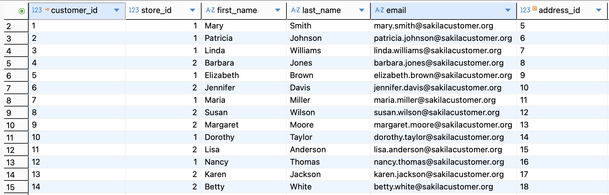

### 2) Вывести имена и фамилии клиентов с именем Carolyn.

```
SELECT first_name, last_name  FROM public.customer
WHERE first_name = 'Carolyn';
```

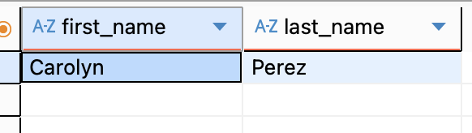

### 3. Вывести полные имена клиентов (имя + фамилия в одной колонке), у которых имя или фамилия содержат подстроку ary (например: Mary, Geary).

```
SELECT *
FROM (
	SELECT first_name || ' ' || last_name AS full_name
	FROM public.customer 
) t
WHERE full_name LIKE '%ary%';
```

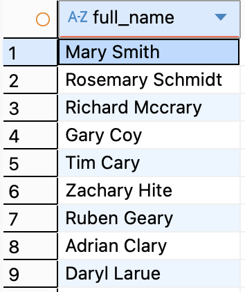

### 4. Вывести 20 самых крупных транзакций (таблица payment).

```
SELECT *
FROM public.payment
ORDER BY amount desc
LIMIT 20;
```

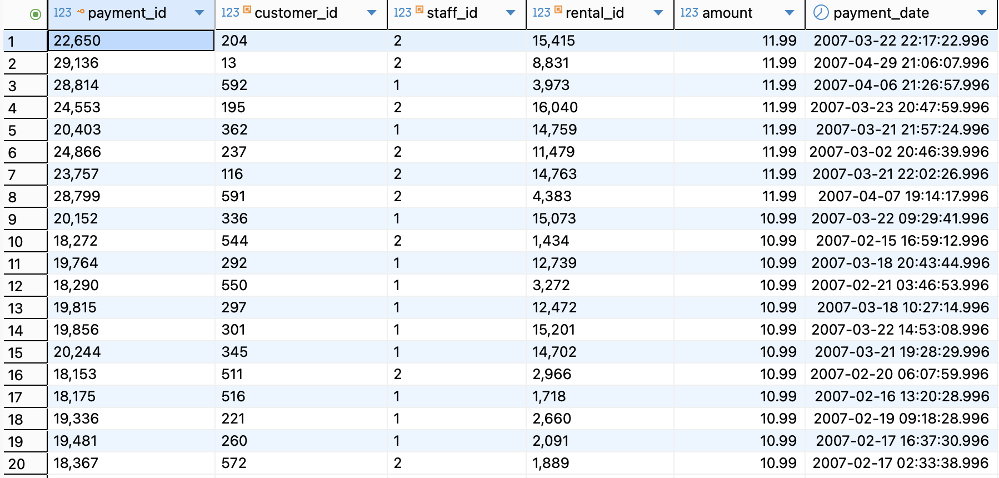

### 5. Вывести адреса всех магазинов, используя подзапрос.

```
SELECT address
FROM public.address
WHERE address_id in (
	SELECT address_id
	FROM store
)
```
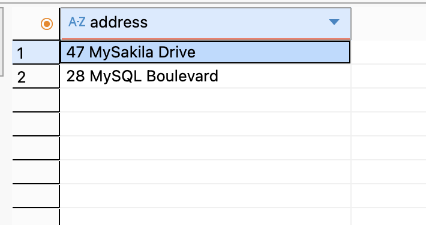

### 6. Для каждой оплаты вывести число, месяц и день недели в числовом формате (Понедельник – 1, Вторник – 2 и т.д.).

```
SELECT payment_id,
	 EXTRACT(DAY FROM payment_date)      AS day,
    EXTRACT(MONTH FROM payment_date)    AS month,
    EXTRACT(ISODOW FROM payment_date)   AS weekday,
    TO_CHAR(payment_date, 'Day') AS weekday_text
FROM payment;
```
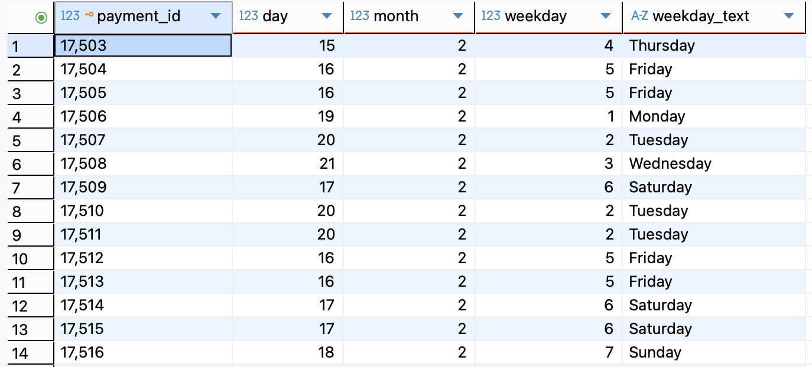

### 7. Вывести, кто (customer_id), когда (rental_date, приведенная к типу date) и у кого (staff_id) брал диски в аренду в июне 2005 года.

```
SELECT customer_id, 
	CAST(rental_date AS date),
	staff_id 
FROM rental
WHERE rental_date >= '2005-06-01' AND rental_date < '2005-07-01';
```

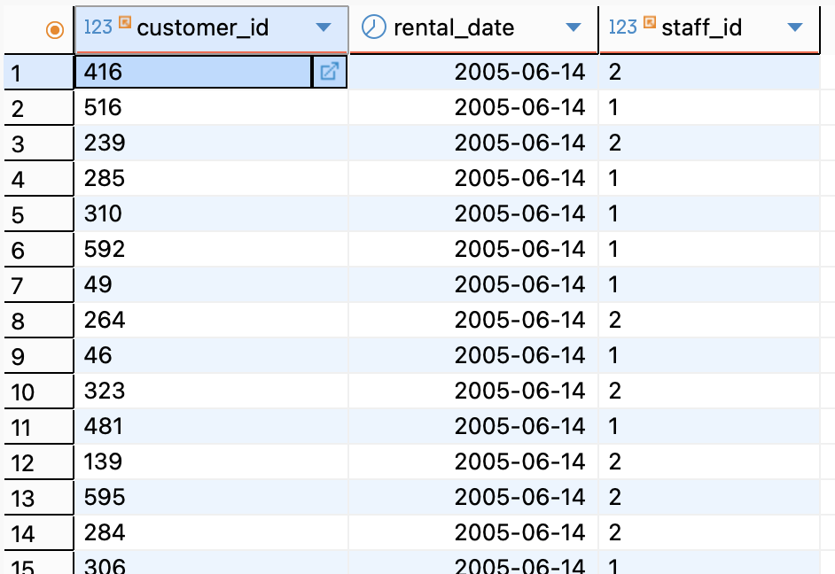

### 8. Вывести название, описание и длительность фильмов (таблица film), выпущенных после 2000 года, с длительностью от 60 до 120 минут включительно. Показать первые 20 фильмов с наибольшей длительностью.

```
SELECT title,
	description,
	length
FROM film
WHERE (length BETWEEN 60 AND 120)  AND release_year >= 2000
ORDER BY length DESC
LIMIT 20;
```

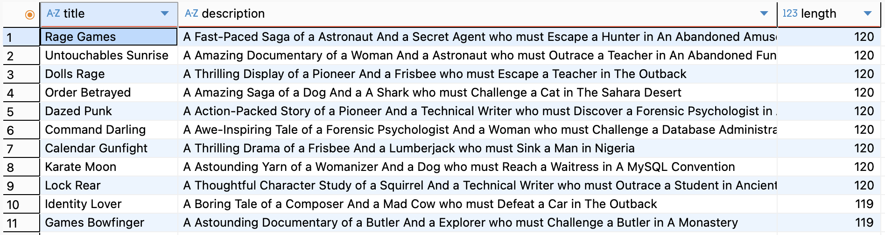

### 9. Найти все платежи (таблица payment), совершенные в апреле 2007 года, стоимость которых не превышает 4 долларов. Вывести идентификатор платежа, дату (без времени) и сумму платежа. Отсортировать платежи по убыванию суммы, а при равной сумме — по более ранней дате.

```
SELECT payment_id,
	CAST(payment_date AS date) AS payment_date_only,
	amount 
FROM payment
WHERE (payment_date >= DATE '2007-04-01' AND payment_date < DATE '2007-05-01')
	AND amount <= 4
ORDER BY amount DESC, payment_date 
```

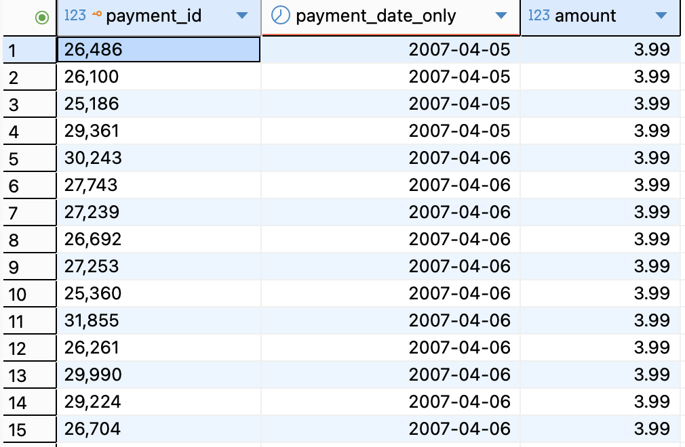

### 10. Показать имена, фамилии и идентификаторы всех клиентов с именами Jack, Bob или Sara, чья фамилия содержит букву «p». Переименовать колонки: с именем — в «Имя», с идентификатором — в «Идентификатор», с фамилией — в «Фамилия». Отсортировать клиентов по возрастанию идентификатора.

```
SELECT first_name AS "Имя",
	last_name AS "Фамилия",
	customer_id AS "Идентификатор"
FROM customer
WHERE first_name IN ('Jack', 'Bob', 'Sara') AND last_name ILIKE '%p%'
ORDER BY customer_id
```


### 11. Работа с собственной таблицей студентов
- Создать таблицу студентов с полями: имя, фамилия, возраст, дата рождения и адрес. Все поля должны запрещать внесение пустых значений (NOT NULL).
- Внести в таблицу одного студента с id > 50.
- Просмотреть текущие записи таблицы.
- Внести несколько записей одним запросом, используя автоинкремент id.
- Снова просмотреть текущие записи таблицы.
- Удалить одного выбранного студента.
- Вывести полный список студентов.
- Удалить таблицу студентов.
- Выполнить запрос на выборку из таблицы студентов и вывести его результат (показать, что таблица удалена).


```
CREATE TABLE students (
    id SERIAL PRIMARY KEY,
    first_name   TEXT NOT NULL,
    last_name    TEXT NOT NULL,
    age          INTEGER NOT NULL,
    birth_date   DATE NOT NULL,
    address      TEXT NOT NULL
);
```

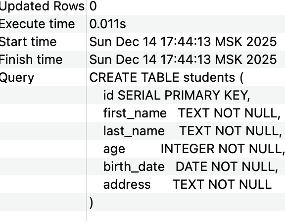

```
INSERT INTO students (id, first_name, last_name, age, birth_date, address)
VALUES (53, 'Ivan', 'Ivanov', 25, '2000-04-13', 'Moscow');
```

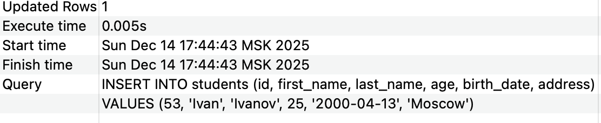

```
SELECT * FROM students;
```
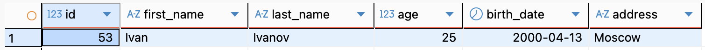

```
INSERT INTO students (first_name, last_name, age, birth_date, address)
VALUES
    ('Andrey', 'Andreev', 24, '2001-04-13', 'Saint Petersburg'),
    ('Maksim', 'Maksimov', 23, '2002-04-13', 'Saratov'),
    ('Roman', 'Romanov', 22, '2003-04-13', 'Ufa');
```
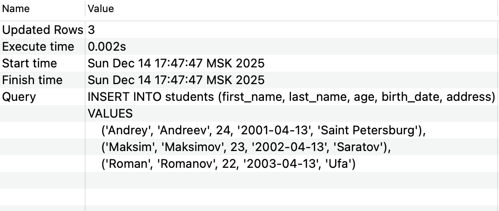

```
SELECT * FROM students;
```
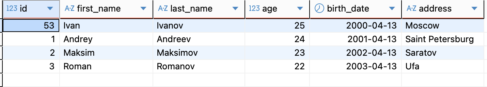

```
DELETE FROM students
WHERE id = 2;
```
```
SELECT * FROM students;
```
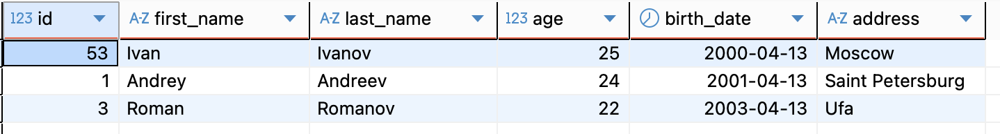

```
DROP TABLE students;
```
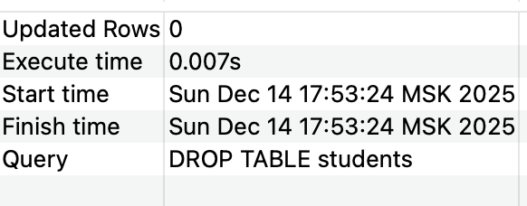

```
SELECT * FROM students;
```
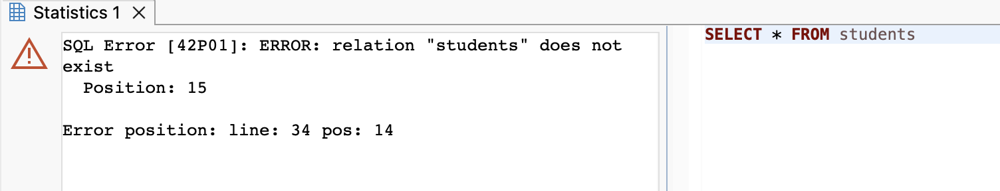


## JOIN и агрегатные функции

### 12. Вывести количество уникальных имен клиентов.
```
SELECT count(distinct(first_name))
FROM customer;
```
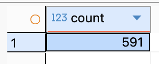


### 13. Вывести 5 самых часто встречающихся сумм оплаты: саму сумму, даты таких оплат, количество платежей с этой суммой и общую сумму этих платежей.
```
SELECT 
	amount,
	ARRAY_AGG(CAST(payment_date AS date)),
	count(amount) AS payment_count,
	sum(amount) AS payment_summ
FROM payment
GROUP BY amount
ORDER BY payment_count DESC
LIMIT 5
```
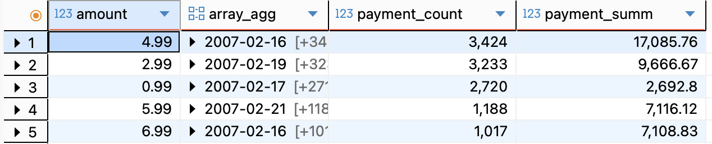


### 14. Вывести количество ячеек (записей) в инвентаре для каждого магазина.
```
SELECT 
	store_id,
	count(inventory_id)
FROM inventory
GROUP BY inventory.store_id 
```
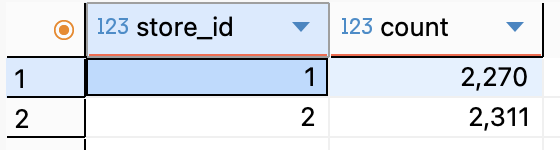


### 15. Вывести адреса всех магазинов, используя соединение таблиц (JOIN).
```
SELECT 
	s.store_id ,
	a.address ,
	c.city,
	c2.country
FROM store s 
JOIN address a ON a.address_id = s.address_id
JOIN city c ON c.city_id = a.city_id 
JOIN country c2 ON c2.country_id  = c.country_id 
```

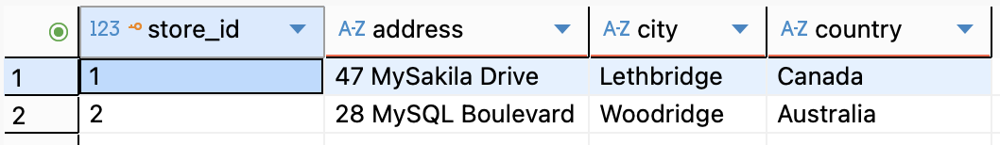

### 16. Вывести полные имена всех клиентов и всех сотрудников в одну колонку (объединенный список).
```
SELECT first_name || ' ' || last_name AS full_name
FROM customer c 

UNION ALL

SELECT first_name || ' ' || last_name  AS full_name
FROM staff s;
```
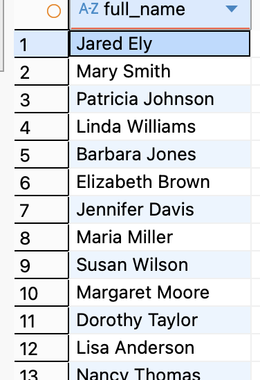


### 17. Вывести имена клиентов, которые не совпадают ни с одним именем сотрудников (операция EXCEPT или аналог).
```
SELECT DISTINCT first_name
FROM customer
EXCEPT
SELECT DISTINCT first_name
FROM staff;
```
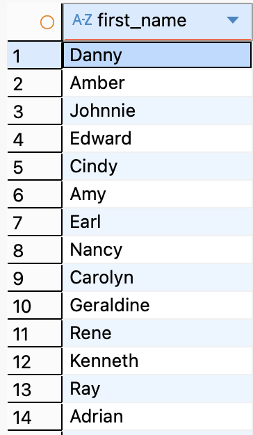

### 18. Вывести, кто (customer_id), когда (rental_date, приведенная к типу date) и у кого (staff_id) брал диски в аренду в июне 2005 года.
```
SELECT 
	customer_id,
	CAST (rental_date AS date) AS rental_date,
	staff_id
FROM rental
WHERE rental_date >= DATE '2005-06-01' AND rental_date < DATE '2005-07-01'

```
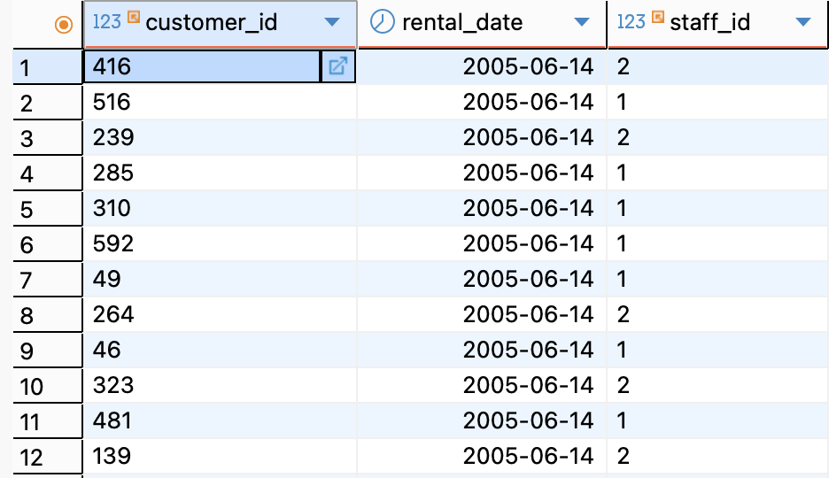

### 19. Вывести идентификаторы всех клиентов, у которых 40 и более оплат. Для каждого такого клиента посчитать средний размер транзакции, округлить его до двух знаков после запятой и вывести в отдельном столбце.
```
SELECT p.customer_id,
	ROUND(AVG(p.amount),2) AS mean_payments
FROM payment AS p
GROUP BY p.customer_id
HAVING COUNT(p.amount) >= 40;

```
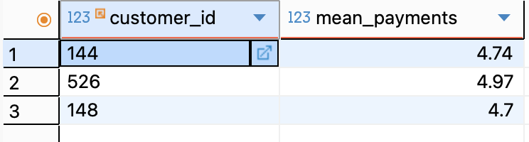

### 20. Вывести идентификатор актера, его полное имя и количество фильмов, в которых он снялся. Определить актера, снявшегося в наибольшем количестве фильмов (группировать по id актера).
```
SELECT 
	fa.actor_id,
	a.first_name || ' ' || a.last_name AS actor_name,
	count(*) AS film_count
FROM film_actor AS fa
JOIN actor AS a ON a.actor_id = fa.actor_id
GROUP BY fa.actor_id , actor_name
ORDER BY film_count DESC
LIMIT 1
```
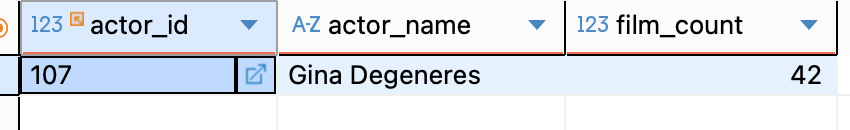


### 21. Посчитать выручку по каждому месяцу работы проката. Месяц должен определяться по дате аренды (rental_date), а не по дате оплаты (payment_date). Округлить выручку до одного знака после запятой. Отсортировать строки в хронологическом порядке. В отчете должен присутствовать месяц, в который не было выручки (нет данных о платежах).
```
WITH months AS (
    SELECT
        generate_series(
            date_trunc('month', (SELECT MIN(rental_date) FROM rental)),
            date_trunc('month', (SELECT MAX(rental_date) FROM rental)),
            interval '1 month'
        ) AS month
)
SELECT
   	TO_CHAR(m.month, 'YYYY-MM') AS month,
    ROUND(COALESCE(SUM(p.amount), 0), 1) AS revenue
FROM months m
LEFT JOIN rental AS r ON date_trunc('month', r.rental_date) = m.month
LEFT JOIN payment AS p ON p.rental_id = r.rental_id
GROUP BY m.month
ORDER BY m.month;
```
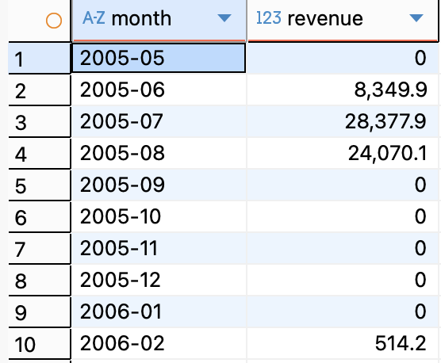

### 22. Найти средний платеж по каждому жанру фильма. Отобразить только те жанры, к которым относится более 60 различных фильмов. Округлить средний платеж до двух знаков после запятой и дать понятные названия столбцам. Отсортировать жанры по убыванию среднего платежа.

```
SELECT 
	c.name AS category_name,
	COUNT(DISTINCT f.film_id) AS category_count,
	ROUND(AVG(p.amount),2) AS avg_payment
FROM payment AS p 
JOIN rental AS r ON r.rental_id = p.rental_id 
JOIN inventory AS i ON i.inventory_id = r.inventory_id 
JOIN film AS f ON f.film_id = i.film_id 
JOIN film_category AS fc ON f.film_id = fc.film_id
JOIN category AS c ON c.category_id = fc.category_id 
GROUP BY c.name
HAVING COUNT(DISTINCT f.film_id) > 60
ORDER BY avg_payment DESC
```

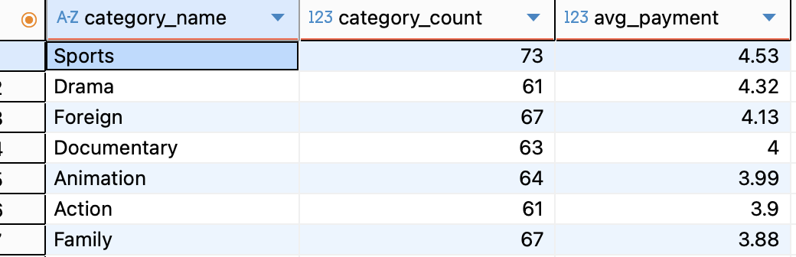

### 23. Определить, какие фильмы чаще всего берут напрокат по субботам. Вывести названия первых 5 самых популярных фильмов. При одинаковой популярности отдать предпочтение фильму, который идет раньше по алфавиту.

```
SELECT 
	f.title,
	count(f.title)
FROM rental AS r
JOIN inventory AS i ON i.inventory_id = r.inventory_id 
JOIN film AS f ON f.film_id = i.film_id 
WHERE EXTRACT(ISODOW FROM r.rental_date) = 6
GROUP BY f.title
ORDER BY count(f.title) DESC, f.title
LIMIT 5
```
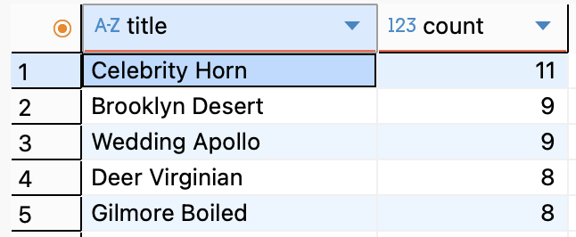

## Оконные функции и простые запросы

### 24. Для каждой оплаты вывести сумму, дату и день недели (название дня недели текстом).
```
SELECT 
	amount,
	CAST(payment_date AS date) AS payment_date,
    TO_CHAR(payment_date, 'Day') AS weekday_text
FROM payment
```
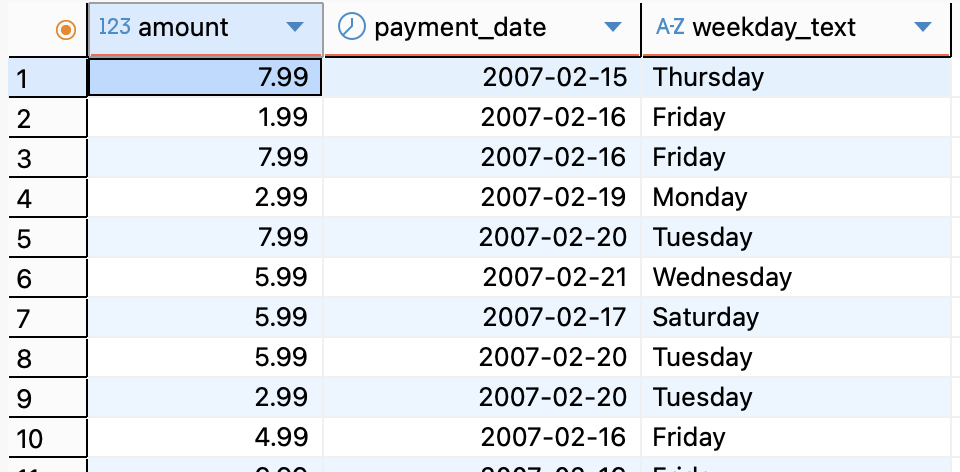


### 25. Для каждой оплаты вывести:
 - сумму платежа;
 - дату платежа;
- день недели, соответствующий дате платежа, в текстовом виде (например: «понедельник», «вторник» и т.п.).
- Распределить фильмы по трем категориям в зависимости от длительности:
	- «Короткие» — менее 70 минут;
	- «Средние» — от 70 минут (включительно) до 130 минут (не включая 130);
	- «Длинные» — от 130 минут и более.
- Для каждой категории необходимо:
	- посчитать количество прокатов (то есть сколько раз фильмы этой категории брались в аренду);
	- посчитать количество фильмов, которые относятся к этой категории и хотя бы один раз сдавались в прокат.
- Фильмы, у которых не было ни одного проката, не должны учитываться в подсчете количества фильмов в категории. Продумать, какой тип соединения таблиц нужно использовать, чтобы этого добиться.  

```
WITH base AS (
    SELECT
        p.amount,
        p.payment_date::date AS payment_date,
        TO_CHAR(p.payment_date, 'FMDay') AS weekday_text,
        f.film_id,
        CASE
            WHEN f.length < 70 THEN 'Короткие'
            WHEN f.length >= 70 AND f.length < 130 THEN 'Средние'
            ELSE 'Длинные'
        END AS len_category
    FROM payment p
    JOIN rental r ON r.rental_id = p.rental_id
    JOIN inventory i ON i.inventory_id = r.inventory_id
    JOIN film f ON f.film_id = i.film_id
),
films_per_category AS (
    SELECT
        len_category,
        COUNT(DISTINCT film_id) AS films_count
    FROM base
    GROUP BY len_category
)
SELECT
    b.amount,
    b.payment_date,
    b.weekday_text,
    b.len_category,
    COUNT(*) OVER (PARTITION BY b.len_category) AS rentals_count,
    fpc.films_count
FROM base b
JOIN films_per_category fpc ON fpc.len_category = b.len_category
ORDER BY b.payment_date;
```

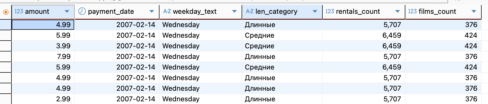


**Для дальнейших заданий считать, что создана таблица weekly_revenue, в которой для каждой недели и года хранится суммарная выручка компании за эту неделю (на основании данных о прокатах и платежах).**

```
CREATE TABLE weekly_revenue (
    year INTEGER NOT NULL,
    week INTEGER NOT NULL,
    revenue NUMERIC(10, 2) NOT NULL,
    PRIMARY KEY (year, week)
);


INSERT INTO weekly_revenue (year, week, revenue)
SELECT
    EXTRACT(YEAR FROM p.payment_date)::int AS year,
    EXTRACT(WEEK FROM p.payment_date)::int AS week,
    SUM(p.amount) AS revenue
FROM payment p
GROUP BY
    EXTRACT(YEAR FROM p.payment_date),
    EXTRACT(WEEK FROM p.payment_date)
ORDER BY year, week;

SELECT *
FROM weekly_revenue;
```

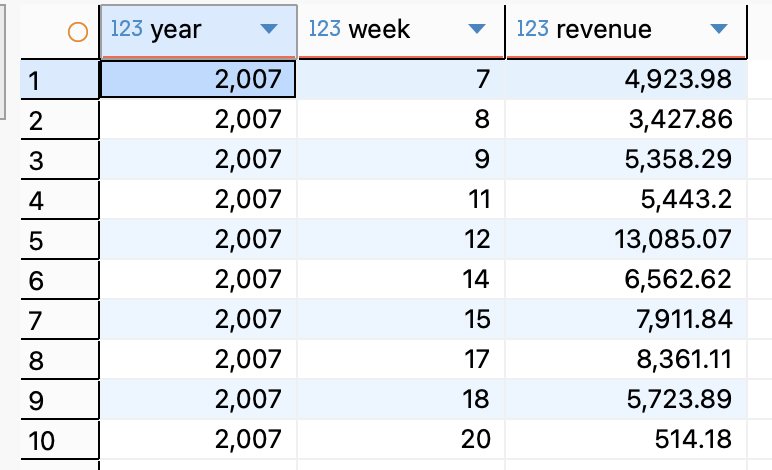

### 26. На основе таблицы weekly_revenue рассчитать накопленную (кумулятивную) сумму недельной выручки бизнеса. Вывести все столбцы таблицы weekly_revenue и добавить к ним столбец с накопленной выручкой. Накопленную выручку округлить до целого числа.
```
SELECT 
	year,
	week,
	revenue,
	ROUND(SUM(revenue) OVER(ORDER BY year, week)) AS cumulative_revenue
FROM weekly_revenue
```
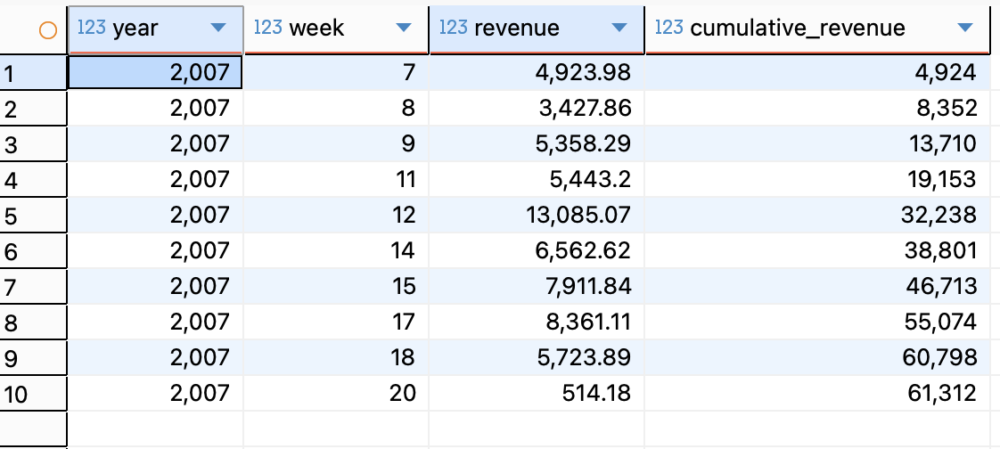


### 27. На основе таблицы weekly_revenue рассчитать скользящую среднюю недельной выручки, используя для расчета три недели: предыдущую, текущую и следующую. Вывести всю таблицу weekly_revenue и добавить:  
- столбец с накопленной суммой выручки;
- столбец со скользящей средней недельной выручки.
- Скользящую среднюю округлить до целого числа.

```
SELECT
    year,
	week,
	revenue,
	ROUND(SUM(revenue) OVER(ORDER BY year, week)) AS cumulative_revenue,
    ROUND(
        (
            COALESCE(LAG(revenue) OVER (ORDER BY year, week), 0)
          + revenue
          + COALESCE(LEAD(revenue) OVER (ORDER BY year, week), 0)
        ) / 
        (
            (CASE WHEN LAG(revenue)  OVER (ORDER BY year, week) IS NULL THEN 0 ELSE 1 END)
          + 1
          + (CASE WHEN LEAD(revenue) OVER (ORDER BY year, week) IS NULL THEN 0 ELSE 1 END)
        )
    ) AS moving_3_weeks_avg_revenue
FROM weekly_revenue;
```

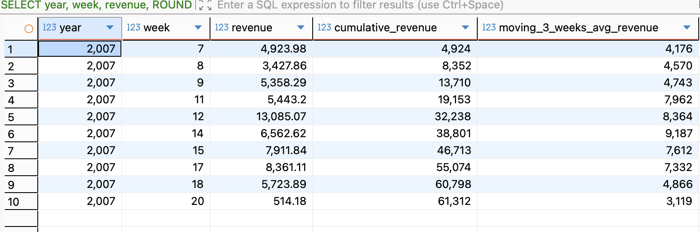

### 28. Рассчитать прирост недельной выручки бизнеса в процентах по сравнению с предыдущей неделей.
Прирост в процентах определяется как:  
(текущая недельная выручка – выручка предыдущей недели) / выручка предыдущей недели × 100%.
Вывести всю таблицу weekly_revenue и добавить:
- ​​​​​​​столбец с накопленной суммой выручки;
- столбец со скользящей средней;
- столбец с приростом недельной выручки в процентах.
- Значение прироста в процентах округлить до двух знаков после запятой.

```
SELECT
    year,
	week,
	revenue,
	ROUND(SUM(revenue) OVER(ORDER BY year, week)) AS cumulative_revenue,
    ROUND(
        (
            COALESCE(LAG(revenue) OVER (ORDER BY year, week), 0)
          + revenue
          + COALESCE(LEAD(revenue) OVER (ORDER BY year, week), 0)
        ) / 
        (
            (CASE WHEN LAG(revenue)  OVER (ORDER BY year, week) IS NULL THEN 0 ELSE 1 END)
          + 1
          + (CASE WHEN LEAD(revenue) OVER (ORDER BY year, week) IS NULL THEN 0 ELSE 1 END)
        )
    ) AS moving_3_weeks_avg_revenue,
    ROUND(
        (revenue - COALESCE(LAG(revenue) OVER (ORDER BY year, week), revenue)) / COALESCE(LAG(revenue) OVER (ORDER BY year, week), revenue) * 100
	,2) AS percentage_increase
FROM weekly_revenue;
```

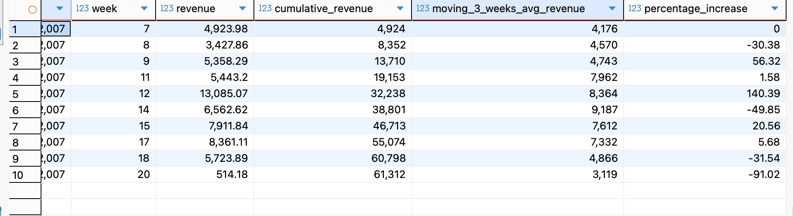