# HW5

## Запуск
1) добавление конфигов в `confid.d`:
- `macros.xml`:
```
<clickhouse>
    <macros>
        <shard>1</shard>
        <replica>1</replica>
    </macros>
</clickhouse>
```

- `zookeeper.xml`:
```
<clickhouse>
    <zookeeper>
        <node>
            <host>st1</host>
            <port>2181</port>
        </node>
        <session_timeout_ms>30000</session_timeout_ms>
        <operation_timeout_ms>10000</operation_timeout_ms>
    </zookeeper>
    <!-- Allow to execute distributed DDL queries (CREATE, DROP, ALTER, RENAME) on cluster. -->
    <!-- Works only if ZooKeeper is enabled. Comment it out if such functionality isn't required. -->
    <distributed_ddl>
        <!-- Path in ZooKeeper to queue with DDL queries -->
        <path>/clickhouse/task_queue/ddl</path>
    </distributed_ddl>
</clickhouse>
```

2) Запуск контейнера `docker compose up --build -d`

3) Проверка корректность работы кластера ClickHouse совместно с ZooKeeper:

```
docker exec -it clickhouse clickhouse-client
```

```
SELECT * 
FROM system.zookeeper 
WHERE path = '/';
```
**Вывод:**
```
Query id: 530df58c-3d67-41fb-a841-3ca444a0167c

   ┌─name───────┬─value─┬─path─┐
1. │ zookeeper  │       │ /    │
2. │ clickhouse │       │ /    │
   └────────────┴───────┴──────┘

2 rows in set. Elapsed: 0.002 sec.
```

4) ПОдключение DBeaver:
- Можно прокинуть порт по ssh если машина не в локальной сети: `ssh -L 8123:localhost:8123 USER@HOST`
- параметры подключения:
```
• Host: localhost (или IP машины)
• Port: 8123
• Database: default
• User name: admin
• Password: admin
```

## Задания:

### Упражнение 1. Запуск и проверка подключения

1. Создать базу данных:
```
CREATE DATABASE IF NOT EXISTS hw1_mt;
SHOW DATABASES;
```
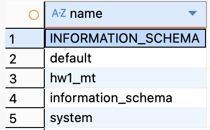

2. В созданной базе данных создать таблицу с движком MergeTree.
```
CREATE TABLE hw1_mt.events
(
    int_val   UInt32,
    uuid_val  UUID,
    dt_val    DateTime,
    str_val   LowCardinality(String)
)
ENGINE = MergeTree
ORDER BY (dt_val);
```

3. В таблице должно быть не менее четырёх столбцов, при этом необходимо использовать различные типы данных (каждый столбец — своего типа).
```
DESCRIBE TABLE hw1_mt.events;
```
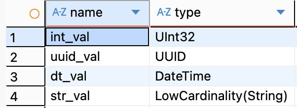

4. Заполнить таблицу тестовыми данными (генерацию данных можно выполнить по примеру, приведенному в приложении 1 или по аналогии).
```
INSERT INTO hw1_mt.events
SELECT
    q.int_val,
    q.uuid_val,
    q.dt_val,
    q.str_val
FROM
(
    SELECT
        modulo(rand(), 999) + 1 AS int_val,
        generateUUIDv4() AS uuid_val,
        now() - INTERVAL rand() / 1000 SECOND AS dt_val,
        rand() / 500000 AS int_val_2,
        multiIf(
            int_val_2 <= 1500, 'A',
            int_val_2 <= 3000, 'B',
            int_val_2 <= 4500, 'C',
            int_val_2 <= 6000, 'D',
            int_val_2 <= 7300, 'E',
            'F'
        ) AS str_val
    FROM numbers(2_000_000)
) q;
```

```
SELECT *
FROM hw1_mt.events
LIMIT 10;
```
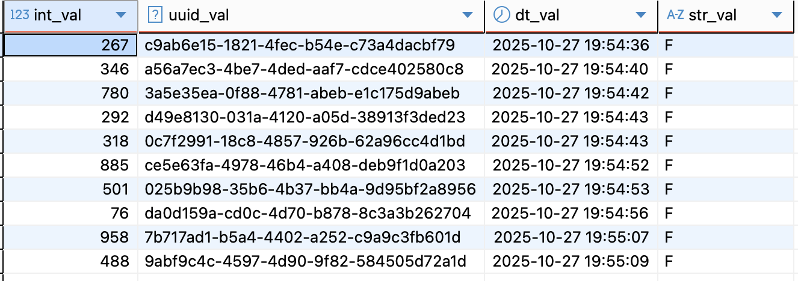

5. Выполнить любой аналитический запрос к созданной таблице, который включает:
   – группировку по одному из столбцов;
   – использование агрегатных функций (например, подсчёт количества уникальных значений и т.п.).

```
SELECT
    str_val,
    count() AS total_rows,
    uniq(int_val) AS uniq_int_vals,
    min(dt_val) AS min_time,
    max(dt_val) AS max_time
FROM hw1_mt.events
GROUP BY str_val
ORDER BY total_rows DESC;
```
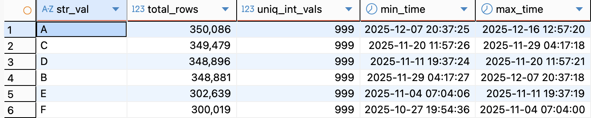

6. Проверить содержимое следующих системных таблиц ClickHouse:

   – `system.clusters`:
   ```
   SELECT * 
    FROM system.clusters;
   ```
   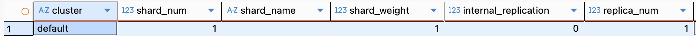


   – `system.macros`;
    ```
   SELECT * 
    FROM system.macros;
   ```
   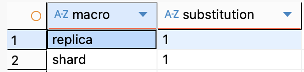

   – `system.zookeeper`;
   ```
   SELECT *
    FROM system.zookeeper
    WHERE path = '/';
   ```
   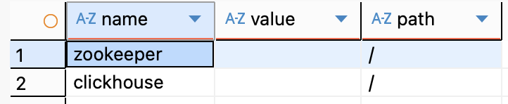


   – `system.distributed_ddl_queue`;
   ```
   SELECT *
    FROM system.distributed_ddl_queue;
   ```
   
   **Пусто**

   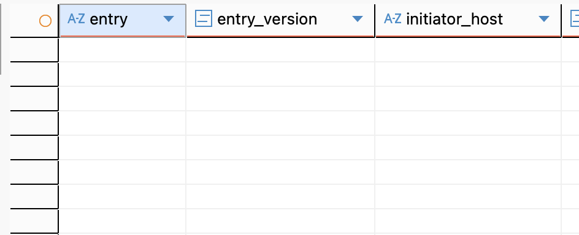


   – `system.replication_queue`;
   ```
   SELECT *
    FROM system.replication_queue;
   ```

    **Пусто**

   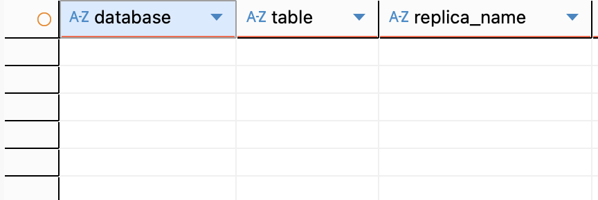


   – `system.trace_log`.

   ```
   SELECT *
    FROM system.trace_log;
   ```

   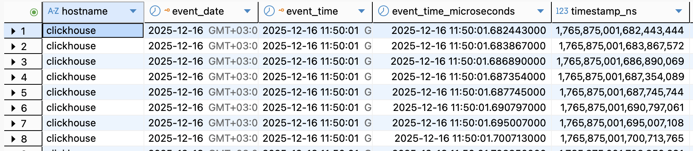

7. Проверить работу следующих функций:
   – `getMacro` (получение значения макроса из конфигурации);

    ```
    SELECT
        getMacro('shard')   AS shard,
        getMacro('replica') AS replica;
    ```

    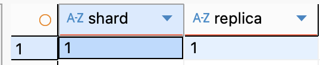

   – `clusterAllReplicas` (использование функции для распределённых запросов по репликам кластера).

    ```
    SELECT *
    FROM clusterAllReplicas('default', system.one);
    ```

    **Одна нода -> одна запись**

    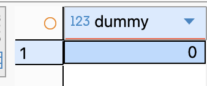

8. С использованием системных таблиц проанализировать и зафиксировать следующие метрики:
   – `время выполнения запросов и объём потребляемой памяти`;
    
    ```
    SELECT
        query,
        query_duration_ms,
        read_rows,
        read_bytes,
        memory_usage
    FROM system.query_log
    WHERE
        type = 'QueryFinish'
        AND query LIKE '%FROM hw1_mt.events%'
    ORDER BY event_time DESC
    LIMIT 5;
    ```

    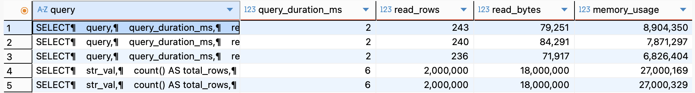

   – объём дискового пространства, занимаемый таблицей:
      в сжатом виде;
      в несжатом виде;
      объём, занимаемый первичным индексом;

    ```
    SELECT
        table,
        round(sum(bytes_on_disk) / 1024 / 1024, 2) AS compressed_mb,
        round(sum(data_uncompressed_bytes) / 1024 / 1024, 2) AS uncompressed_mb,
        sum(primary_key_bytes_in_memory) AS primary_key_b
    FROM system.parts
    WHERE database = 'hw1_mt'
    AND table = 'events'
    GROUP BY table;
    ```

    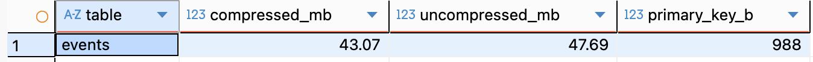


   – объём дискового пространства по каждому столбцу таблицы:
      в сжатом виде;
      в несжатом виде.

    ```
    SELECT
        column,
        round(sum(column_bytes_on_disk) / 1024 / 1024, 3) AS compressed_mb,
        round(sum(column_data_uncompressed_bytes) / 1024 / 1024, 3) AS uncompressed_mb
    FROM system.parts_columns
    WHERE database = 'hw1_mt'
    AND table = 'events'
    GROUP BY column
    ORDER BY compressed_mb DESC;
    ```

    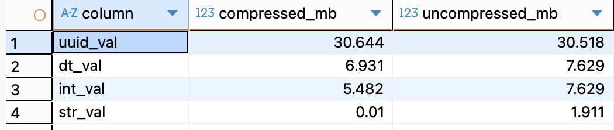


### Упражнение 2. Размер вставки

9. Создать две таблицы с движком MergeTree.

    создаем таблицы:

    ```
    CREATE TABLE hw1_mt.mt_small
    (
        int_val   UInt32,
        uuid_val  UUID,
        dt_val    DateTime,
        str_val   LowCardinality(String)
    )
    ENGINE = MergeTree
    ORDER BY dt_val;


    CREATE TABLE hw1_mt.mt_buffered
    (
        int_val   UInt32,
        uuid_val  UUID,
        dt_val    DateTime,
        str_val   LowCardinality(String)
    )
    ENGINE = MergeTree
    ORDER BY dt_val;
    ```

10. Для второй таблицы создать дополнительную таблицу с движком Buffer, через которую будет выполняться вставка данных.

    ```
    CREATE TABLE hw1_mt.mt_buffer
    (
        int_val   UInt32,
        uuid_val  UUID,
        dt_val    DateTime,
        str_val   LowCardinality(String)
    )
    ENGINE = Buffer(
        hw1_mt,    
        mt_buffered, 
        16,   # количество независимых буферов
        10,   # минимальное время до сброса
        60,   # максимальное время для сброса
        100000,  # минимальное количество строк
        1000000,  # максимальное количество строк
        10000000, # минимальный объём данных 
        100000000 # максимальный объём данных
    );
    ```

11. С помощью скрипта запустить одновременную автоматическую вставку записей в обе таблицы.
    Вставка в первую таблицу MergeTree должна выполняться мелкими пачками.  
    Вставка во вторую таблицу MergeTree должна выполняться крупными пачками с использованием буферизации через таблицу с движком Buffer.  

    Параллельный запуск:

    ```
    #!/bin/bash

    CLICKHOUSE="docker exec -i clickhouse clickhouse-client -u admin --password admin"

    insert_small() {
    for i in {1..300}; do
        $CLICKHOUSE <<'SQL'
    INSERT INTO hw1_mt.mt_small
    SELECT
        modulo(rand(), 999) + 1,
        generateUUIDv4(),
        now() - INTERVAL rand() / 1000 SECOND,
        multiIf(
            rand() / 500000 <= 1500, 'A',
            rand() / 500000 <= 3000, 'B',
            rand() / 500000 <= 4500, 'C',
            rand() / 500000 <= 6000, 'D',
            rand() / 500000 <= 7300, 'E',
            'F'
        )
    FROM numbers(5000);
    SQL
        sleep 0.5
    done
    }

    insert_buffer() {
    for i in {1..300}; do
        $CLICKHOUSE <<'SQL'
    INSERT INTO hw1_mt.mt_buffer
    SELECT
        modulo(rand(), 999) + 1,
        generateUUIDv4(),
        now() - INTERVAL rand() / 1000 SECOND,
        multiIf(
            rand() / 500000 <= 1500, 'A',
            rand() / 500000 <= 3000, 'B',
            rand() / 500000 <= 4500, 'C',
            rand() / 500000 <= 6000, 'D',
            rand() / 500000 <= 7300, 'E',
            'F'
        )
    FROM numbers(5000);
    SQL
        sleep 0.5
    done
    }

    insert_small & insert_buffer & wait
    ```

    Итог:

    ```
    SELECT
        table,
        count() AS parts,
        sum(rows) AS rows
    FROM system.parts
    WHERE database = 'hw1_mt'
    AND table IN ('mt_small', 'mt_buffered')
    AND active
    GROUP BY table;
    ```

    ```
    SELECT
        table,
        count() AS parts,
        sum(rows) AS rows
    FROM system.parts
    WHERE database = 'hw1_mt'
    AND table IN ('mt_small', 'mt_buffered')
    AND active
    GROUP BY table;
    ```

    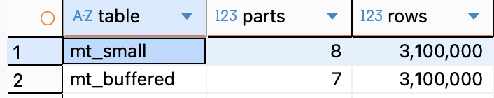

    Количество активных и неактивных партиций:

    ```
    SELECT
        table,
        active,
        count() AS parts_count,
        sum(rows) AS rows_count
    FROM system.parts
    WHERE database = 'hw1_mt'
    AND table IN ('mt_small', 'mt_buffered')
    GROUP BY table, active
    ORDER BY table, active DESC;
    ```

    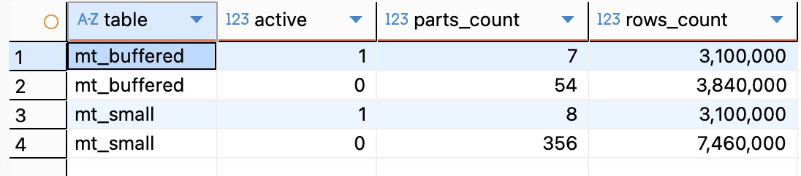


### Упражнение 3. Оптимизация Order by

15. Создать таблицу в соответствии с выданным описанием (см. скрипт в приложении).

    ```
    DROP TABLE IF EXISTS default.person_data;

    CREATE TABLE default.person_data (
    id          UInt64,
    region      LowCardinality(String),
    date_birth  Date,
    gender      UInt8,
    is_marital  UInt8,
    dt_create   DateTime DEFAULT now()
    )
    ENGINE = MergeTree()
    ORDER BY (date_birth);

    ```

16. Заполнить таблицу сгенерированными данными, используя предоставленный скрипт.

    ```
    INSERT INTO default.person_data(id, region, date_birth, gender, is_marital)
    SELECT
        q.id,
        q.region,
        toStartOfDay(q.date_birth) AS date_birth,
        q.gender,
        q.is_marital
    FROM
    (
        SELECT
            rand() AS id,
            modulo(id, 70) + 20 AS n,
            toString(n) AS region,
            floor(randNormal(10000, 1700)) AS k,
            toDate('1970-01-01') + INTERVAL k DAY AS date_birth,
            if(modulo(id, 3) = 1, 1, 0) AS gender,
            if((n + k) % 3 = 0 AND dateDiff('year', date_birth, now()) > 18, 1, 0) AS is_marital
        FROM numbers(100_000_000)
    ) q;
    ```

    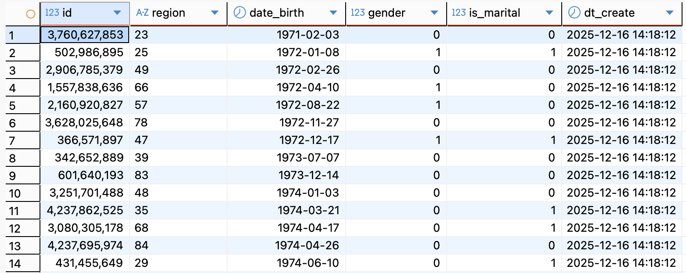

17. Выполнить оптимизацию таблицы таким образом, чтобы в результате остался только один кусок (одна партиция).

    ```
    OPTIMIZE TABLE default.person_data FINAL;
    ```

    ```
    SELECT
        count() AS active_parts,
        sum(rows) AS rows
    FROM system.parts
    WHERE database = 'default'
    AND table = 'person_data'
    AND active;
    ```

    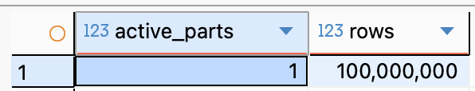

18. Выполнить указанные запросы (см. приложение) и для каждого запроса:
   – определить среднее время выполнения на серии запусков (не менее 5);
   – зафиксировать количество обработанных строк (параметр PROCESSED, возвращаемый clickhouse-client);
   – проверить объём памяти, занимаемый первичным ключом таблицы.

   - объем памяти:

   ```
    SELECT
        table,
        round(sum(primary_key_bytes_in_memory) / 1024 / 1024, 2) AS primary_key_mb
    FROM system.parts
    WHERE database = 'default'
    AND table = 'person_data'
    AND active
    GROUP BY table;
   ```

    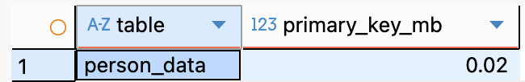


   a) Первый запрос:
    
```
SELECT t.region,
    countIf(gender = 1 AND date_diff('year', t.date_birth, now()) BETWEEN 20 AND 40) AS cnt_male,
    countIf(gender = 0 AND date_diff('year', t.date_birth, now()) BETWEEN 18 AND 30) AS cnt_female
FROM default.person_data t
WHERE t.date_birth BETWEEN toDate('2000-01-01') AND toDate('2000-01-31')
AND t.region IN ('20', '25', '43', '59')
GROUP BY t.region; 
```

Вывод: 
- **Processed 622.59 thousand rows**

    ```
        ┌─region─┬─cnt_male─┬─cnt_female─┐
    1. │ 43     │     2976 │       5791 │
    2. │ 25     │     2923 │       5844 │
    3. │ 59     │     2929 │       5870 │
    4. │ 20     │     2953 │       5979 │
    └────────┴──────────┴────────────┘

    4 rows in set. Elapsed: 0.004 sec. Processed 622.59 thousand rows, 2.49 MB (176.41 million rows/s., 705.64 MB/s.)
    Peak memory usage: 4.12 MiB.
    ```

- Среднее время = 3 ms.

    ```
    SELECT
        query_duration_ms,
        read_rows,
        read_bytes
    FROM system.query_log
    WHERE query LIKE '%FROM default.person_data%'
    AND type = 'QueryFinish'
    ORDER BY event_time DESC
    LIMIT 5;
    ```


    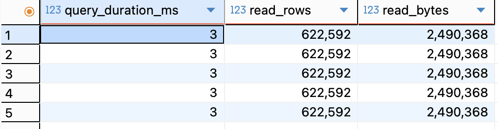

    b) Второй запрос:

```
SELECT countIf(gender = 1 AND date_diff('year', t.date_birth, now()) BETWEEN 20 AND 40) AS cnt_male,
    countIf(gender = 0 AND date_diff('year', t.date_birth, now()) BETWEEN 18 AND 30) AS cnt_female
FROM default.person_data t
WHERE t.is_marital = 1
AND t.region IN ('80')
GROUP BY t.region;
```

Вывод: 
- **Processed 97.47 million rows**

    ```
    ┌─cnt_male─┬─cnt_female─┐
    1. │   152916 │     214788 │
    └──────────┴────────────┘

    1 row in set. Elapsed: 0.034 sec. Processed 97.47 million rows, 347.23 MB (2.84 billion rows/s., 10.13 GB/s.)
    Peak memory usage: 17.85 MiB.
    ```

- среднее время = 33.6 ms.

    ```
    SELECT
    query_duration_ms,
    read_rows,
    read_bytes
    FROM system.query_log
    WHERE query LIKE '%FROM default.person_data%'
    AND type = 'QueryFinish'
    ORDER BY event_time DESC
    LIMIT 5;
    ```

    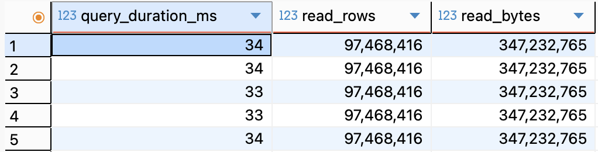

19. Оптимизировать ORDER BY и PRIMARY KEY таблицы так, чтобы:
   – объём памяти, занимаемый первичным индексом, был минимален;
   – метрики выполнения запросов (время и объём обрабатываемых данных) улучшились.

    - СОздаем таблицу, меняем ORDER BY на region:

    ```
    CREATE TABLE default.person_data_opt (
    id          UInt64,
    region      LowCardinality(String),
    date_birth  Date,
    gender      UInt8,
    is_marital  UInt8,
    dt_create   DateTime
    )
    ENGINE = MergeTree()
    ORDER BY (region, date_birth);

    INSERT INTO default.person_data_opt
    SELECT *
    FROM default.person_data;
    ```

    a) Первый запрос:
    
    ```
    SELECT t.region,
        countIf(gender = 1 AND date_diff('year', t.date_birth, now()) BETWEEN 20 AND 40) AS cnt_male,
        countIf(gender = 0 AND date_diff('year', t.date_birth, now()) BETWEEN 18 AND 30) AS cnt_female
    FROM default.person_data_opt t
    WHERE t.date_birth BETWEEN toDate('2000-01-01') AND toDate('2000-01-31')
    AND t.region IN ('20', '25', '43', '59')
    GROUP BY t.region; 
    ```

    Вывод: 
    - **Processed 65.54 thousand rows** меньше чем **Processed 622.59 thousand rows**
    - **817.39 KiB.** меньше чем **4.12 MiB**

        ```
           ┌─region─┬─cnt_male─┬─cnt_female─┐
        1. │ 43     │     2976 │       5791 │
        2. │ 25     │     2923 │       5844 │
        3. │ 59     │     2929 │       5870 │
        4. │ 20     │     2953 │       5979 │
        └────────┴──────────┴────────────┘

        4 rows in set. Elapsed: 0.004 sec. Processed 65.54 thousand rows, 262.19 KB (15.14 million rows/s., 60.56 MB/s.)
        Peak memory usage: 817.39 KiB.
        ```

        - Среднее время = 3 ms.

        ```
        SELECT
            query_duration_ms,
            read_rows,
            read_bytes
        FROM system.query_log
        WHERE query LIKE '%FROM default.person_data_opt%'
        AND type = 'QueryFinish'
        ORDER BY event_time DESC
        LIMIT 5;
        ```


        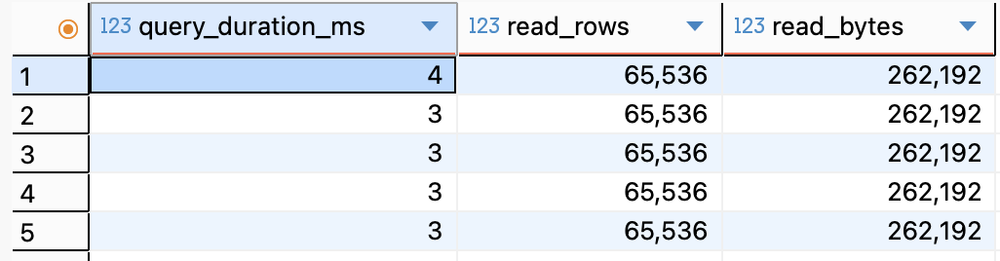

    b) Второй запрос:

        ```
        SELECT countIf(gender = 1 AND date_diff('year', t.date_birth, now()) BETWEEN 20 AND 40) AS cnt_male,
            countIf(gender = 0 AND date_diff('year', t.date_birth, now()) BETWEEN 18 AND 30) AS cnt_female
        FROM default.person_data_opt t
        WHERE t.is_marital = 1
        AND t.region IN ('80')
        GROUP BY t.region;
        ```

    Вывод: 
    - **Processed 1.50 million rows** меньше чем **Processed 97.47 million rows**
    - **3.94 MiB.** меньше чем **17.85 MiB**

        ```
        ┌─cnt_male─┬─cnt_female─┐
        1. │   152916 │     214788 │
        └──────────┴────────────┘

        1 row in set. Elapsed: 0.006 sec. Processed 1.50 million rows, 7.43 MB (261.67 million rows/s., 1.30 GB/s.)
        Peak memory usage: 3.94 MiB.
        ```

    - среднее время = 5 ms.

        ```
        SELECT
            query_duration_ms,
            read_rows,
            read_bytes
        FROM system.query_log
        WHERE query LIKE '%FROM default.person_data%'
        AND type = 'QueryFinish'
        ORDER BY event_time DESC
        LIMIT 5;
        ```

        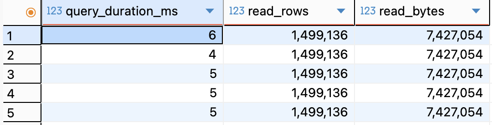

### Упражнение 4. Сжатие данных

20-22. На основании таблицы, полученной в результате выполнения задания 2, создать новую таблицу с той же структурой и теми же данными. Подобрать кодеки сжатия для столбцов новой таблицы таким образом, чтобы выполнялись следующие условия:
• общий объём, занимаемый таблицей на диске, уменьшился не менее чем на 25 % по сравнению с исходной таблицей;
• среднее время выполнения обоих рассматриваемых запросов не увеличилось более чем на 10–15 %, при этом желательно, чтобы оно улучшилось.

- Создаем таблицу с кодеками:
```
CREATE TABLE default.person_data_codec (
    id          UInt64 CODEC(ZSTD(3)),
    region      LowCardinality(String) CODEC(LZ4),
    date_birth  Date CODEC(Delta, LZ4),
    gender UInt8,
	is_marital UInt8,
    dt_create   DateTime CODEC(Delta, LZ4)
)
ENGINE = MergeTree()
ORDER BY (date_birth);
```

- Переносим данные со старой таблицы и сливаем партиции:
```
INSERT INTO default.person_data_codec
SELECT *
FROM default.person_data;
```

```
OPTIMIZE TABLE default.person_data FINAL;
OPTIMIZE TABLE default.person_data_codec FINAL;
```

- Замеряем объем
```
SELECT
    table,
    round(sum(bytes_on_disk) / 1024 / 1024, 2) AS size_mb
FROM system.parts
WHERE database = 'default'
  AND table IN ('person_data', 'person_data_codec')
  AND active
GROUP BY table;
```

Улучшение на 24% по памяти


a) Первый запрос - без изменений:

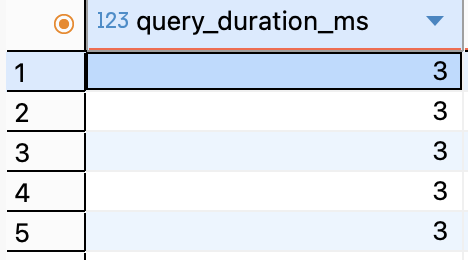


б) Второй запрос - ухудшение на 10%:

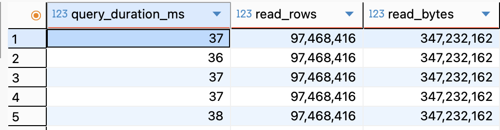